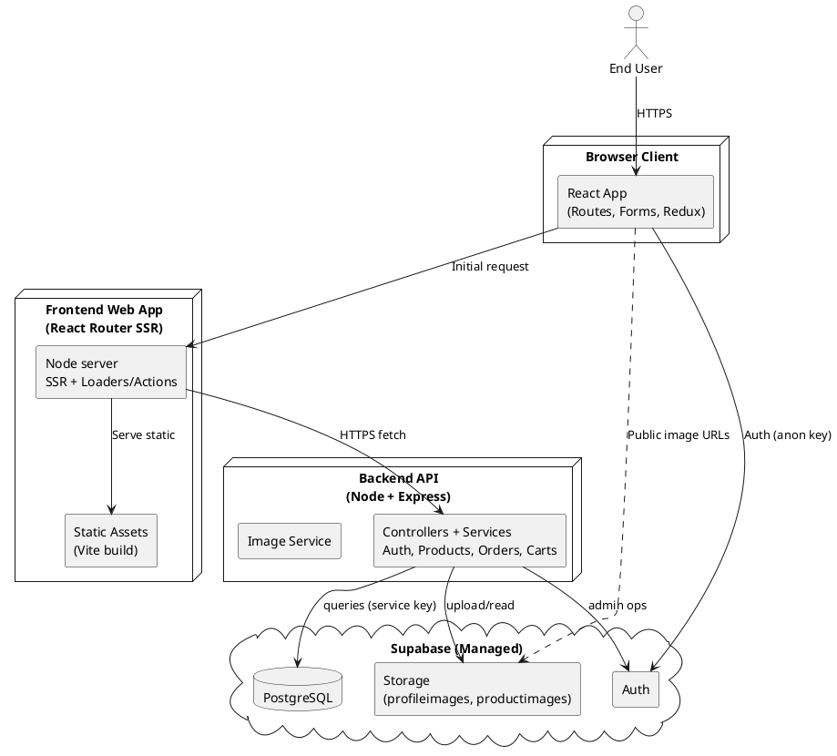

## Container (Architecture) Diagram

This document outlines the system at the container level: browser client, frontend SSR app, backend API, and managed services (Supabase Auth, Postgres, Storage).

### Mermaid (compact, clean)

Paste into draw.io: Insert → Advanced → Mermaid.

```mermaid
flowchart TB
  %% Personas
  user((End User)):::person

  %% Right column (Client)
  subgraph CLIENT[Browser Client]
    B["React App\n(Routes · Forms · Redux)"]:::fe
  end

  %% Middle column (FE SSR + API)
  subgraph FE[Frontend Web App\n(React Router SSR)]
    SSR["Node server\n(SSR · Loaders/Actions)"]:::fe
    ASSETS["Static assets\n(Vite)"]:::infra
  end

  subgraph API_BOX[Backend API\n(Node · Express)]
    API["Controllers/Services\nAuth · Products · Orders · Carts"]:::be
    IMG[Image Service]:::be
  end

  %% Bottom (Managed services)
  subgraph SUPA[Supabase (Managed)]
    AUTH[Auth]:::svc
    DB[(PostgreSQL)]:::db
    STORE[[Storage\n(profileimages · productimages)]]:::svc
  end

  %% Flows
  user -->|HTTPS| B
  B -->|Initial request| SSR
  SSR -->|Serve| ASSETS
  B -->|Fetch JSON| API
  API -->|queries| DB
  API -->|admin ops| AUTH
  API -->|upload/read| STORE
  B -->|Auth (anon)| AUTH
  B -.->|Public image URLs| STORE

  %% Styles
  classDef person fill:#fafafa,stroke:#777,stroke-width:1px,color:#111
  classDef fe fill:#e7f0ff,stroke:#2f6feb,stroke-width:1px,color:#0b3d91
  classDef be fill:#e9f7ef,stroke:#2ca44f,stroke-width:1px,color:#1b5e20
  classDef svc fill:#fff4e6,stroke:#fb8c00,stroke-width:1px,color:#8a4b08
  classDef db fill:#f3e5f5,stroke:#8e24aa,stroke-width:1px,color:#4a148c
  classDef infra fill:#eceff1,stroke:#607d8b,stroke-width:1px,color:#263238
```

### Mermaid (detailed, swimlane-style)

```mermaid
flowchart LR
  %% Lanes: Client | Application | Managed
  subgraph L1[Client]
    user((End User)):::person
    B["Browser: React App\nRoutes · Forms · Redux"]:::fe
  end

  subgraph L2[Application]
    subgraph FE[Frontend (React Router SSR)]
      SSR["Node server\nSSR · Loaders/Actions"]:::fe
      ASSETS["Static assets\n(Vite)"]:::infra
    end
    subgraph BE[Backend (Express)]
      API["Controllers/Services\nAuth · Products · Orders · Carts"]:::be
      IMG[Image Service]:::be
    end
  end

  subgraph L3[Managed Services]
    AUTH[Auth]:::svc
    DB[(PostgreSQL)]:::db
    STORE[[Storage\n(profileimages · productimages)]]:::svc
  end

  %% Edges
  user -->|HTTPS| B
  B -->|Initial request| SSR
  SSR -->|Serve| ASSETS
  B -->|HTTPS (loaders/actions)| API
  API --> DB
  API --> AUTH
  API --> STORE
  B -->|Auth (anon)| AUTH
  B -.->|Public image URLs| STORE

  %% Styles
  classDef person fill:#fafafa,stroke:#777,stroke-width:1px,color:#111
  classDef fe fill:#e7f0ff,stroke:#2f6feb,stroke-width:1px,color:#0b3d91
  classDef be fill:#e9f7ef,stroke:#2ca44f,stroke-width:1px,color:#1b5e20
  classDef svc fill:#fff4e6,stroke:#fb8c00,stroke-width:1px,color:#8a4b08
  classDef db fill:#f3e5f5,stroke:#8e24aa,stroke-width:1px,color:#4a148c
  classDef infra fill:#eceff1,stroke:#607d8b,stroke-width:1px,color:#263238
```

### PlantUML (optional, works with draw.io PlantUML plugin)

In draw.io: File → Plugins → Enable PlantUML (if available), then Insert → Advanced → PlantUML.



### Notes

- Frontend uses React Router SSR: server renders routes, then hydrates in the browser.
- Backend exposes RESTful endpoints (auth, products, orders, carts) consumed by both SSR loaders/actions and client fetches.
- Supabase provides Auth, Postgres, and Storage. Backend uses server key for privileged operations; the browser may use anon key for basic auth/session flows.
- Images are uploaded via backend to Supabase Storage; clients view public URLs.

### How to view the diagram in draw.io

- Mermaid
  - diagrams.net → Insert → Advanced → Mermaid → paste one of the Mermaid blocks above → Insert.
- PlantUML
  - diagrams.net → File → Plugins → enable PlantUML (if available) → Insert → Advanced → PlantUML → paste the PlantUML block.

Tips for better formatting in draw.io:

- Select the diagram → Arrange → Layout → rank same-direction to keep lanes aligned.
- Set a consistent font (e.g., Inter) and size 12–13 for readability.
- Reduce long labels; keep to two lines per node when possible.
